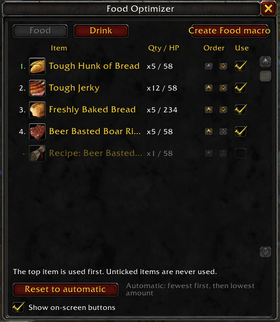
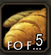

# Food Optimizer

A World of Warcraft Classic addon that decides which food and drink to eat for you, so your bags stay tidy.

By default it eats the food you have the **fewest** of first. That stack runs out sooner and frees up a bag slot. When two foods tie, it eats the one that restores the **least** first, and it saves your best food for later. You can also set the order yourself.



## Features

- **Scans all your bags** and finds every food (restores health over time) and drink (restores mana over time). It skips potions, recipes, and food that needs a higher level than you are.
- **Smart default order:** fewest first, then lowest amount restored. It always eats from your smallest stack.
- **Your own order:** open the panel with `/fo` and move items up or down with the arrows. Your order is saved.
- **Never use an item:** untick **Use** to keep something out of rotation, such as buff food you're saving for a raid.
- **Separate food and drink**, each with its own tab, button and macro.
- **Movable on-screen buttons:** drag the handle above them to put them anywhere, then lock them in place from the panel.
- **Action bar macros:** one click creates a macro. The action bar button always shows the icon, tooltip and count of what it will eat next.



## Installation

1. **[Download FoodOptimizer.zip](https://github.com/lucasreppewelander/FoodOptimizer/releases/latest/download/FoodOptimizer.zip)**
2. Extract it into `World of Warcraft/_classic_era_/Interface/AddOns/`. You should end up with `AddOns/FoodOptimizer/FoodOptimizer.toc`.
3. Restart the game or type `/reload`.

Don't use GitHub's green **Code → Download ZIP** button. It names the folder `FoodOptimizer-main`, and WoW won't load the addon from a folder with that name.

If the addon shows as out of date, tick **Load out of date AddOns** on the character select screen. You can also update the `## Interface:` line in `FoodOptimizer.toc` to your client's version. Run `/dump select(4, GetBuildInfo())` in game to find it.

## Usage

1. Type `/fo` to open the panel.
2. Pick the **Food** or **Drink** tab and arrange the order if you want. The top item is eaten first.
3. Click **Create Food macro** or **Create Drink macro**. The macro lands on your cursor, so drop it on an action bar.
4. Press the action bar button whenever you want to eat or drink.

The addon keeps the macros up to date as your bags change. Macros can't be changed during combat, so any changes made in combat apply as soon as the fight ends.

### Moving the on-screen buttons

While the buttons are unlocked, a **Drag** handle sits above them. Left-drag the handle, or right-drag either button, to move both buttons together. Tick **Lock button position** in the panel, or type `/fo lock`, to hide the handle and keep them in place. You can't move them during combat.

Position, show/hide and lock are saved per character. Food order and unticked items are shared by all your characters.

### Slash commands

| Command | Description |
| --- | --- |
| `/fo` | Open or close the order panel |
| `/fo show` / `/fo hide` | Show or hide the small on-screen buttons |
| `/fo lock` / `/fo unlock` | Lock or unlock the on-screen buttons' position |
| `/fo reset` | Move the on-screen buttons back to their default spot |

### Manual macros

If you'd rather write the macros yourself:

```
/click FoodOptimizerFoodButton
```

```
/click FoodOptimizerDrinkButton
```

## Notes

- WoW doesn't let addons use items on their own, so eating always needs a key press or click. The addon only picks *what* gets eaten.
- Items that restore both health and mana (like Conjured Mana Biscuits) show up on both tabs. Untick them on the tab you don't want them used from.
- Tooltip reading only works on English game clients.
- Built for the Classic Era client (1.15.x).
